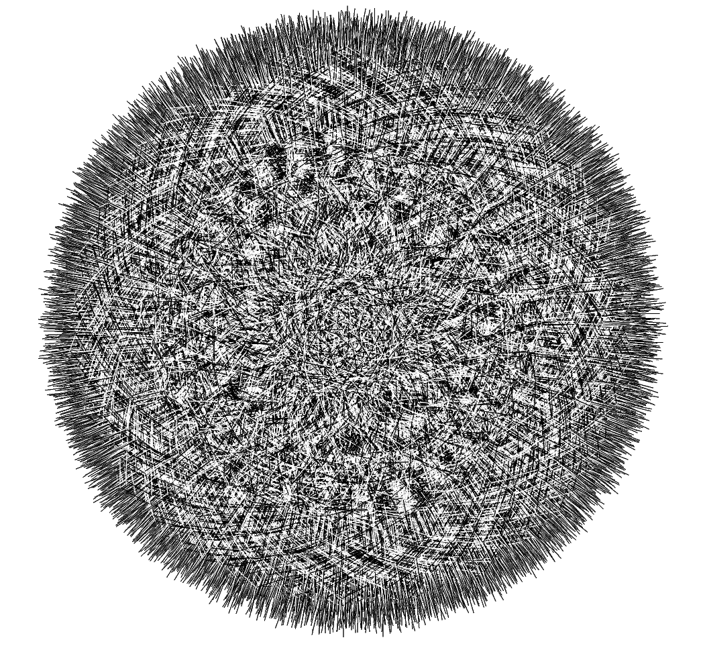
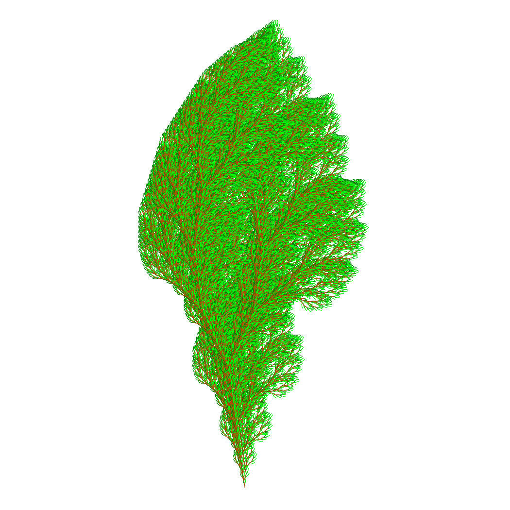

# ED 1 Work 2 

https://github.com/engylemure/trab_ufes/tree/master/ed1/trab2 


I've tried to use some past works with C to study and improve my knowledge with Rust.

## Requirements

 - [rust](https://www.rust-lang.org/tools/install)

 ## Usage

To run the examples you should access the `turtle_graph` folder to use some `make` commands that has some examples the inputs are on the `grammar` folder to visualize it you can open some pdf visualization program that will draw the outputed file.


 ```
 make testCircle
```


In this example you can use the command `evince circle.ps` to visualize the output on `linux` for example.


For the `make testKoch2` example you would be able to visualize that:





or `make testTree`:




